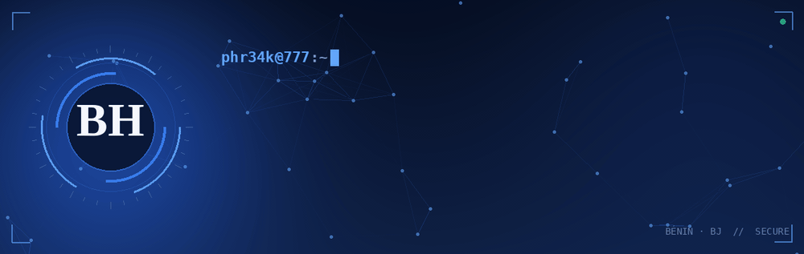

<h1 align="center">Salut 👋, je suis BOTON H. Désiré</h1>
<h3 align="center">Analyste en cybersécurité & Développeur Full-Stack Python (Django) du Bénin 🇧🇯</h3>

Analyste en cybersécurité, développeur Full-Stack Python (Django) et joueur de CTF, je suis passionné par l'intelligence artificielle 🤖 et les technologies de pointe 🌐. J'aime comprendre comment les systèmes fonctionnent, les attaquer pour mieux les défendre 🛡️, et explorer de nouvelles technologies pour construire des projets innovants 🛠️. Étudiant en Mathématiques-Informatique, je cherche constamment à repousser mes limites.

 

  
  
  
  
  
  

 

  
  
  
  
  
  

  

- 🔭 Je suis actuellement **étudiant en Mathématiques-Informatique**

- 🌱 J'approfondis la **cybersécurité (Red Team & Blue Team)**, l'**IA** et les technologies de pointe

- 👨‍💻 Tous mes projets sont disponibles sur [mon portfolio](https://phr34k-777.github.io)

- 💬 Demande-moi des questions sur **la science, la technologie, la cybersécurité et le piratage (Red Team & Blue Team)**

- 📫 Pour me contacter : **botonhdesire@gmail.com**

- 📄 Découvre mon parcours : [mon CV](https://phr34k-777.github.io/#resume)

- ⚡ Fun fact : **je n'arrête pas de me demander « et si je devenais quelqu'un d'autre ? »** 😄

 
<h3 align="left">Retrouve-moi ici :</h3>

 

<h3 align="left">Langages et outils :</h3>

- Backend

  

- Frontend

  

- Base de données

  

- Serveurs Cloud

  

- Outils

  

 

 <em><b>J'aime échanger avec des personnes passionnées</b>, alors si tu veux dire <b>salut, je serai ravi de te rencontrer !</b> :)</em>

 

 Créé avec 🧡 par <a href="https://phr34k-777.github.io">BOTON H. Désiré</a>

